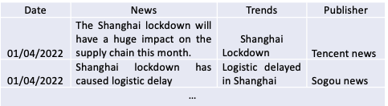
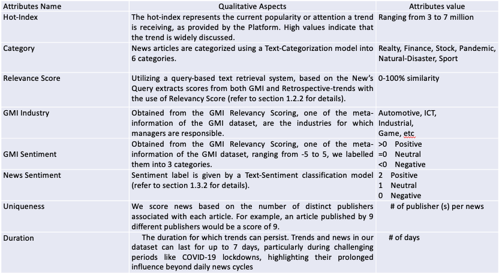

# Demand Forecasting: Integrating Textual and Market Data to Navigate Irregular Market Disruption

## Introduction

Challenges in B2B Demand Forecasting
Complex Supply Chains
Global supply chains introduce variability in lead times and inventory availability
Coordination across multiple suppliers adds forecasting uncertainty

Economic & Market Volatility
Shifting economic conditions (e.g., currency fluctuations, policy changes) impact demand unpredictably
Market trends and customer behavior are dynamic and hard to predict in real-time

Limitations of Traditional Models
Rely on delayed and stable data sources like government and industry reports, historical sales data
Provide macro-level insights but struggle with short-term market disruptions

## Introduction – Proposed approach

Integrating high-frequency indicators that provide real-time data and nuanced analysis can significantly improve forecast accuracy and responsiveness

The proposed methodology in this paper leverages trends and news from these platforms, extracts textual insights, and informs our strategy thus enabling quicker and more informed forecasting decisions

## Methodology


### 1. Overview of Methodology

<p align="center">
  
</p> 
<p align="center">Fig 1. Overview of Methodology</p> 

- High-Frequency Textual Event Disruption 
Analyzer (HFT-EDA)
The HFT-EDA employs advanced Natural Language Processing (NLP) techniques to extract significant events from social media platforms and links these events to company product sales

- Market Health Analyzer (MHA)
The MHA integrates relevant stock market indexes and a broad set of indicators

Together, this framework provides a robust methodology for assessing market irregularities at macro and micro levels

### 2. Details of Methodology

<p align="center">
  
</p> 
<p align="center">Fig 2. Details of Methodology</p> 

- High-Frequency Textual Event Disruption Analyzer (HFT-EDA)
Leverages social media data to blend trends and news, providing immediate insights. This component derives crucial metrics such as hot-index, uniqueness, and duration to deepen the understanding of sentiments and trends

    ```
    Lead Generation : Collect data from Trends and News

    - Trends: Emerging events identified through user searches and social media activity
    - News: Detailed information and analysis that provides context and depth to the trends

    Collection method 
        - Online API
        - Crawler
        - Service from third-party data provider etc
    ```

    Examples of collected Trends and News data:
    <p align="center">
        
    </p> 
    <p align="center">Fig 2.1 LeadGeneration</p> 


    ```
    Lead Capture: Filter and refine news and trends data to ensure only relevant business information is retained by using a two-step filtering approach: Topic categorization (classification) and relevancy scoring process

    Topic categorization
        Model: “Randeng-T5-784M-MultiTask-Chinese” LLM model
        Usage: Classify news into different categories, retain categories of interest
        Categories of interest: 
        Set 1: Realty, Finance, Stocks
        Set 2: Pandemic, Sport, Natural-disaster (Concentrated on active sales areas in China)

    Relevancy scoring
        Reference data: Internally developed Global Market Insights (GMI) dataset (Curated by Sales Managers across divisions (Automotive, Industrial, ICT, Realty, etc.))
        Usage: Compare the semantic similarities between news trends and GMI content to measure relevance, helping assess their potential impact on product sales
    ```
    Examples of GMI Dataset Sample:
    <p align="center">
        
    </p> 
    <p align="center">Fig 2.2 GMI Samples Data</p> 

    ```
    Lead Attributes : Extract text-based indexes (to gain a deeper contextual understanding of the emerging trends and news)
    ```
    Examples of LeadAttributes:
    <p align="center">
        
    </p> 
    <p align="center">Fig 2.3 LeadAttributes</p> 

    ```
    Lead Impact: Calculate an “Impact Factor” as an aggregated score for selected trend attributes, representing insights derived from textual data

    Weighted sum scheme across attributes such as hot-index, uniqueness of the news, trend duration, news duration, GMI relevance score, news sentiment, and GMI sentiment. This score helps indicate stable and turbulent periods (derived from lead attributes)


    ```
    

- Market Health Analyzer (MHA)
Employs a comprehensive array of indicators, including hard, soft, and high-frequency indicators, to assess broader market dynamics

    - Hard Indicators: Based on measurable data from government or reputable institutions (e.g., GDP, industrial production, housing data, inflation, interest rates). While they provide a stable economic context, they are often lagging due to infrequent updates

    - Soft Indicators: Derived from surveys and perceptions, these are typically available faster than hard indicators. Examples include the Purchasing Managers' Index, Consumer Price Index, in China. They offer early signals of economic changes, helping stakeholders gauge sentiment and expectations that influence decisions

    - High-Frequency Indicators: Provide near real-time data, allowing businesses to anticipate demand shifts during unexpected events and adjust strategies quickly. This includes stock market, transportation, and freight data

    Our main focus is to choose relevant high-frequency indicators available from the stock market
    Country-specific Exchange-Traded Funds (ETF) baseline:

    <p align="center">
        
    </p> 
    <p align="center">Fig 2.4 Country-Specific ETF</p> 

    Sector-specific ETF (to gain deeper insights into the performance of the Chinese market and its underlying sectors):

    <p align="center">
        
    </p> 
    <p align="center">Fig 2.5 Sector-Specific ETF</p> 

    ### 3. Integration of HFT-EDA and MHA Attributes

    <p align="center">
    
    </p> 
    <p align="center">Fig 3. Integration of HFT-EDA and MHA Attributes</p> 

    Attribution preprocessing:
    Lead attributes:
    Nominal variables: Perform one-hot encoding for nominal variables and aggregate them by summing their values during aggregation

    Interval variables: Calculate the mean score

    MHA’s attributes: Numerical variables: Calculate the median value

### 4. Demand Forecasting Pipeline

<p align="center">
  
</p> 
<p align="center">Fig 4. Demand Forecasting Pipeline</p> 

We utilized a comprehensive end-to-end demand forecasting pipeline that encompasses feature selection, performance ranking, and model selection

We chose to focus our case study on the sales of four products used in electronic home and industrial appliances  during the Shanghai lockdown period (April 2022)

We evaluated on 4 products, each product undergoes modelling and experimentation under three scenarios: 
    1. Baseline Model: Model trained using baseline indicators (economic indicators)
    2. Mix_IRX Model: Model trained using baseline indicators and IRX indicators
    3. IRX Model: Model trained using IRX indicators only

## Analysis

<p align="center">
  
</p> 
<p align="center">Fig 5. Unique Trends and Category Distribution (Bi-weekly)</p> 

<p align="center">
  
</p> 
<p align="center">Fig 6. Trend Categories and News Categories discrepancy</p> 

<p align="center">
  
</p> 
<p align="center">Fig 7. Hot index per Category</p> 

<p align="center">
  
</p> 
<p align="center">Fig 8. Discrepancies between GMI and News Sentiment</p> 

<p align="center">
  
</p> 
<p align="center">Fig 9. Regional sales and GMI Relevancy</p> 

<p align="center">
  
</p> 
<p align="center">Fig 10. Regional sales and GMI Sentiment</p> 

<p align="center">
  
</p> 
<p align="center">Fig 11. Regional Sales and Impact Factor</p> 

<p align="center">
  
</p> 
<p align="center">Fig 12. Regional Sales and CHIR and CHIC</p> 

## Results

<p align="center">
  
</p> 
<p align="center">Fig 13. Product-A Forecasting Result</p> 

<p align="center">
  
</p> 
<p align="center">Fig 14. Product-B Forecasting Result</p> 

<p align="center">
  
</p> 
<p align="center">Fig 15. Product-C Forecasting Result</p> 

<p align="center">
  
</p> 
<p align="center">Fig 16. Product-D Forecasting Result</p> 


## Conclusion

Novel Methodology

    We developed a demand forecasting approach for the B2B sector by integrating high-frequency indicators from social media and stock market data

    Utilized NLP to monitor trending topics and news on social media, linking significant events to macroeconomic data and product sales for better forecasting accuracy

    This approach proved particularly valuable during crises (e.g., COVID-19 lockdown), capturing rapid market shifts that traditional models missed

Future work

    Expanding to English-Speaking Markets
    The methodology will be applied to English-speaking countries using relevant data sources, enhancing the model’s generalizability across different markets

    Improving the Model

    The Irregular Market Disruption (IRX) index performed better during market turbulence but matched the baseline during recovery phases. Incorporating the Lead Impact Factor could help optimize performance by activating or deactivating IRX components based on market conditions
